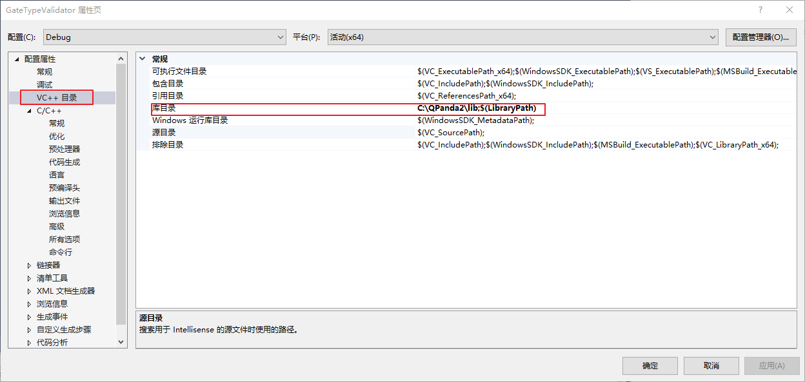
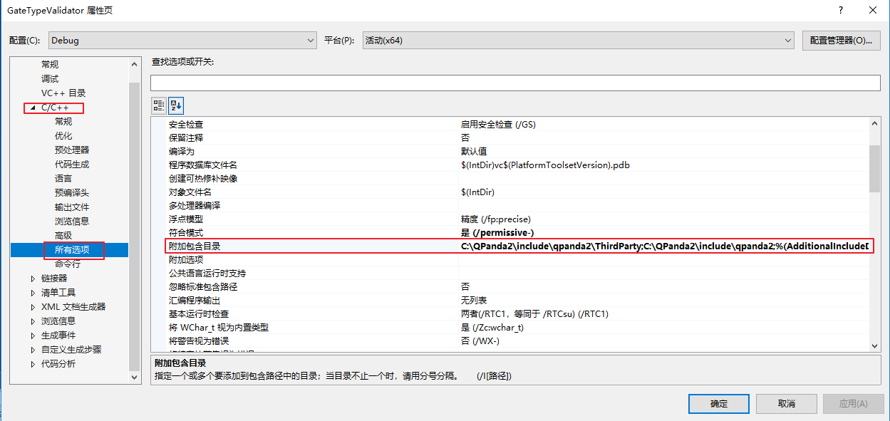
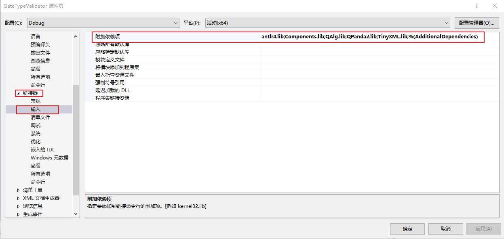
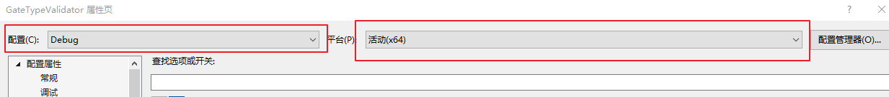

# QPanda-Example
QPanda-Example是QPanda的示例库，为用户提供了多种QPanda的使用示例。

# 使用教程

## visual studio 2017

visual studio 2017 下链接QPanda库需要配置QPanda的头文件地址和QPanda库的地址，下面以GateTypeValidator项目为例：

1. 选择中GateTypeValidator项目,右键选中属性。


2. 设置库目录 ,选中VC++目录 -> 库目录，设置lib库路径${QPanda的安装路径}/lib



3. 设置附加包含目录，选中C/C++ -> 所有选项 -> 附加包含目录，设置两个路径${QPanda的安装路径}/include/qpanda2;${QPanda的安装路径}/include/qpanda2/ThirdParty



4. 设置运行库, 选中C/C++ -> 所有选项 -> 运行库，设置为MT


5. 设置附加依赖项,选中链接器 -> 输入 -> 附加依赖项，设置以下依赖库：antlr4.lib;Components.lib;QAlg.lib;QPanda2.lib;TinyXML.lib



在设置visual studio 2017项目属性时，需要注意配置的是Debug还是Release版本，同时要设置平台为X64。



## MinGW、Linux、macOS

MinGW、Linux、macOS链接QPanda库，可以使用CMake工具，下面以GateTypeValidator项目为例，使用命令如下：

```
cd GateTypeValidator
mkdir -p build
cd build
cmake -DQPANDA_INSTALL_DIR=/usr/local/ .. #/usr/local/ 是笔者的安装QPanda的路径
make
```

