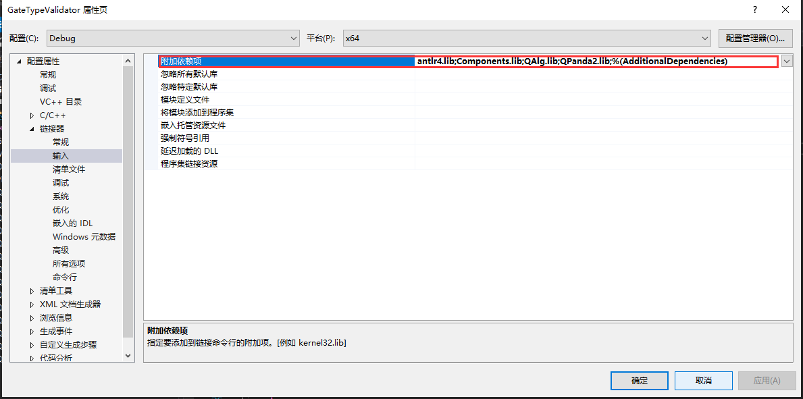
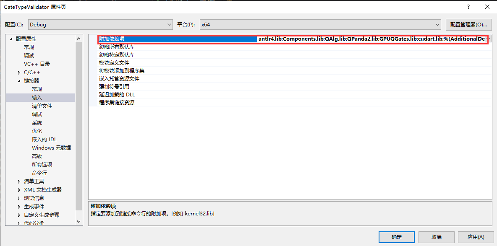

# QPanda-Example
QPanda-Example是QPanda的示例库，为用户提供了多种QPanda的使用示例。

# 使用教程

## visual studio 2017

visual studio 2017 下链接QPanda库需要配置QPanda的头文件地址和QPanda库的地址，下面以GateTypeValidator项目为例：

1. 选择中GateTypeValidator项目,右键选中属性。


2. 设置附加包含目录，选中C/C++ -> 所有选项 -> 附加包含目录，设置两个路径${QPanda的安装路径}/include/qpanda2;${QPanda的安装路径}/include/qpanda2/ThirdParty


如果使用的QPanda2库是包含GPU计算部分的时候还需要添加cuda头文件的安装路径，设置的路径为：${QPanda的安装路径}/include/qpanda2;${QPanda的安装路径}/include/qpanda2/ThirdParty;${CUDA库的路径}/include


3. 设置运行库, 选中C/C++ -> 所有选项 -> 运行库，设置为MT


4. 设置库目录 ,选中VC++目录 -> 库目录，只需要设置lib路径${QPanda的安装路径}/lib


如果使用的QPanda2库是包含GPU计算部分的时候还需要添加cuda库的安装路径，设置的路径为：${QPanda的安装路径}/include/qpanda2;${QPanda的安装路径}/include/qpanda2/ThirdParty;${CUDA库的路径}/lib/x64


如果安装的是包含GPU计算方式的库需要设置lib路径${QPanda的安装路径}/lib;{CUDA库的路径}/lib/x64

5. 设置附加依赖项,选中链接器 -> 输入 -> 附加依赖项，设置以下依赖库：antlr4.lib;Components.lib;QAlg.lib;QPanda2.lib



包含GPU计算方式还需要添加下面两个库：
GPUQGates.lib;cudart.lib



6. 设置符合模式，选中C/C++- > 语言 -> 符合模式，设置为否


在设置visual studio 2017项目属性时，一定要注意配置管理器中的Release和Debug、及x64要与项目所选的相同（QPanda2不支持x86平台）。


## MinGW

```
g++ test.cpp -std=c++14 -fopenmp -I{QPanda安装路径}/include/qpanda2/ -I{QPanda安装路径}/include/qpanda2/ThirdParty/ -L{QPanda安装路径}/lib/ -lQPanda2 -lantlr4 -o test

```

## Linux

不含CUDA的编译指令

```
g++ test.cpp -std=c++14 -fopenmp -I{QPanda安装路径}/include/qpanda2/ -I{QPanda安装路径}/include/qpanda2/ThirdParty/ -L{QPanda安装路径}/lib/ -lQPanda2 -lComponents -lantlr4 -o test
```

含有CUDA的编译指令

```
g++ test.cpp -std=c++14 -fopenmp -I{QPanda安装路径}/include/qpanda2/ -I{QPanda安装路径}/include/qpanda2/ThirdParty/ -L{QPanda安装路径}/lib/ -lQPanda2 -lComponents -lantlr4 -lGPUQGates -L{CUDA安装路径}/lib/  -lcudart -o test
```

## MacOS

```
clang++ test.cpp -std=c++14 -fopenmp -I{QPanda安装路径}/include/qpanda2/ -I{QPanda安装路径}/include/qpanda2/ThirdParty/ -L{QPanda安装路径}/lib/ -lQPanda2 -lComponents -lantlr4 -o test
```

含有CUDA的编译指令

```
clang++ test.cpp -std=c++14 -fopenmp -I{QPanda安装路径}/include/qpanda2/ -I{QPanda安装路径}/include/qpanda2/ThirdParty/ -L{QPanda安装路径}/lib/ -lQPanda2 -lComponents -lantlr4 -lGPUQGates -L{CUDA安装路径}/lib/  -lcudart -o test
```

# 使用CMake的方式调用QPanda2库

## Virsual Studio 

由于VS的版本比较多，不同的版本使用CMake会有一些差距，这里就以Virsual Studio 2017为例

首先打开VS，选中 文件->打开->CMake


然后选择QPanda-example文件夹中的示例下的CMakeLists.txt点击，就会打开一个示例


再选择CMakeSetting.json文件，修改-DQPANDA_INSTALL_DIR={QPanda2安装目录}


修改后，ctrl+s，选择CMAKE->全部生成


点击图中的下拉小箭头，选择可执行程序


上面介绍了使用cmake打开我们构建好的工程，有兴趣的也可以深入的学习使用cmake构建项目。

## MinGW

MinGW链接QPanda库，可以使用CMake工具，下面以GateTypeValidator项目为例，使用命令如下：

```
cd GateTypeValidator
mkdir -p build
cd build
cmake -G"MinGW Makefiles" -DQPANDA_INSTALL_DIR=C:/QPanda2/ .. # C:/QPanda2/ 是笔者的安装QPanda的路径
mingw32-make
```

## Linux、macOS

Linux、macOS链接QPanda库，可以使用CMake工具，下面以GateTypeValidator项目为例，使用命令如下：

```
cd GateTypeValidator
mkdir -p build
cd build
cmake -DQPANDA_INSTALL_DIR=/usr/local/ .. #/usr/local/ 是笔者的安装QPanda的路径
make
```

